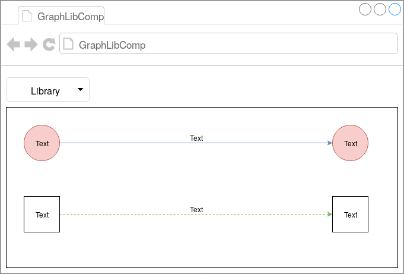

# GraphLibComp
This project implements a basic website using seven different graphic frameworks for comparison.

# Getting started
## Prerequisites
You need [NodeJS](https://nodejs.org/en/) installed.
Follow this [Documentation](https://docs.npmjs.com/getting-started/installing-node), if you never have used NodeJS or NPM.

After installation
```bash
sudo npm install -g bower
sudo npm install -g gulp
```

## Installing
Install the dependencies
```bash
bower install
```
Run the demo
```
gulp
```
# Design
To show the capabilities of every graphic framework, we will implement a basic website with the following requirements:
- Two different shapes (with customizable text and color)
- Arrows (solid and dashed, customizable text and color)

The following images show the mockup


# Frameworks
The following frameworks are used in this project (not sorted in any particular order)

[JointJS](https://www.jointjs.com/)

[Raphaël](http://dmitrybaranovskiy.github.io/raphael/)

[Draw2D](http://www.draw2d.org/draw2d/home/index.html)

[D3](https://d3js.org/)

[FabricJS](http://fabricjs.com/)

[PaperJS](http://paperjs.org/)

[JSPlumb](https://jsplumbtoolkit.com/)

# License
This project is licensed under the MIT License - see the [LICENSE.md](LICENSE.md) file for details

# Contributing
Please read [CONTRIBUTING.md](CONTRIBUTING.md) for details on our code of conduct, and the process for submitting pull requests to us.

