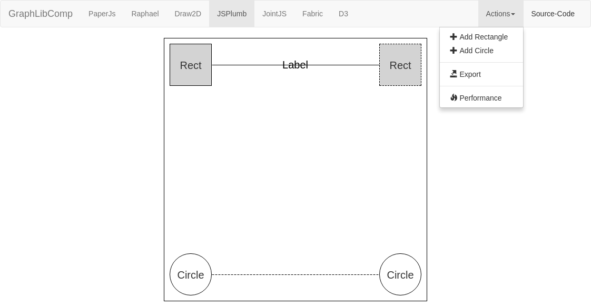

[](https://travis-ci.org/winery/GraphLibComp)

<hr>

# GraphLibComp
This project implements a basic website using seven different graphic frameworks for comparison.

# Getting started
## Prerequisites
You need [NodeJS](https://nodejs.org/en/) installed.
Follow this [Documentation](https://docs.npmjs.com/getting-started/installing-node), if you never have used NodeJS or NPM.

After installation
```bash
npm install
sudo npm install -g bower
sudo npm install -g gulp
```

## Installing
Install the dependencies in the different framework
```bash
bower install
```
Run the demo
```
gulp
```
# Design
To show the capabilities of every graphic framework, we will implement a basic website with the following requirements:
- Two different shapes 
- Arrows (solid and dashed)

The following images show the application     


# Frameworks
The following frameworks are used in this project.

[D3](https://d3js.org/)

[Draw2D](http://www.draw2d.org/draw2d/home/index.html)

[FabricJS](http://fabricjs.com/)

[JSPlumb](https://jsplumbtoolkit.com/)

[JointJS](https://www.jointjs.com/)

[PaperJS](http://paperjs.org/)

[Raphaël](http://dmitrybaranovskiy.github.io/raphael/)

# Performance Test
The following three frameworks have a performance test option.

[Draw2D](http://www.draw2d.org/draw2d/home/index.html)

[JSPlumb](https://jsplumbtoolkit.com/)

[JointJS](https://www.jointjs.com/)

The test of the performance is done by generating a X * Y Grid, where X is the count of elements on the x-axis and Y is the count of elements on the y-axis. The max value for X and Y is 100 and the min value for X and Y is 1.


# License
This project is licensed under the MIT License - see the [LICENSE.md](LICENSE.md) file for details
