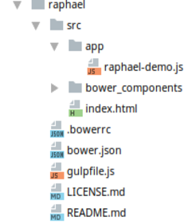

# JS Guidelines
This file describes the coding guidelines for programming with Javascript for the GraphLib Comp.

##### IIFE
Every library demo code should be put inside an Immediately-invoked Function Expression (IIFE).
For more information why you should use [IFFE](https://wiki.selfhtml.org/wiki/IIFE).    
Example:
```javascript
(function() {
  //Your code goes here
})()
```

##### Variable declaration and naming
All variables should be declared at the top of the file.     
The name should be in camelCase and start with a letter. For the name we should choose either **rect** or **circle** 
followed by another letter or number.    
Example:
```javascript
(function() {
    var myLibraryDependencyObject = ...;
    var rectLeft = ...;
    var rectRight = ...;
    var circleLeft = ...;
    var circleRight = ...;
})()
```
##### Function declaration and naming
Functions should be declared right after the declaration of the variables.
The naming should be meaningful and in camelCase. There should be init-Functions for the demo 
which are called in a **main** function.    
Example:
```javascript
(function() {
    var rectLeft = ...;
    var rectRight = ...;
    var circleLeft = ...;
    var circleRight = ...;
    
    function initRect() {
      //Do something with rectLeft and rectRight
    }
    
    function initCircle() {
      //Do something with circleLeft and circleRight
    }
    
    function main() {
        //Do some other init code
        initRect();
        initCircle();
    }
})()
```
##### Usage of 3rd Party library
The usage of 3rd party libraries should held down to a minimum, because this project aims mainly to show
the capabilities or the lack of capabilities of the graphic frameworks. Nevertheless if you have to use 3rd party libraries
or if the framework needs them, they should be first at the top of the file with the appropiate framework name.
```javascript
(function() {
    var raphael = Raphael.paper();
})()
```
##### Project structure
The following image shows the project structure.    


*Description*
- The top level directory must be name like the framework
- There should be only one demo file which implements the demo scenario. This file should be put inside *src/app* directory of
the demo. The name should be as following ${FRAMEWORK}-demo.js
- The bower.json should be edited to contain the developers email and a description
- The index.html should be name *index.html* and should be put inside the *src/* directory.


##### Design
The following image show the template design. As we are using bootstrap3, please refer to [Bootstrap](http://getbootstrap.com/)
for style of HTML elements.   


##### Design Description
**Rectangle**    
- Color for Rectangle: #99999
- Color for Rectangle Borders: #000
- Rectangle Left: Solid Border
- Rectangle Right: Dashed Border
- Solid Arrow from Left Rectangle to Right Rectangle
- Label on Arrow with Text *Label*
- Text inside rectangle saying *Rect*
- Text Color: #000
- Width: 80px, Height: 80px

**Circle**
- Color for Circle: #000 
- Color for Circle Borders: #000
- Both Circle : Solid Border
- Dashed Arrow from Right Circle to Left Circle
- Text inside circles saying *Circle*
- Text Color: #000
- Radius: 40px

##### General Layout
The circles and rectangle should be places inside a Bootstrap *container* in the middle of the page with a solid #000 border.
The *container* should be a bounding box which means the element cannot be dragged outside of the container.
There should be 2 buttons between the container.
- Add Circle 
- Add Rectangle    

The buttons should be layouted as block bars which means their width will fit the container.

On Click on one of those elements a popover should open up with 2 options
- Dashed : Connect to another element with a dashed arrow
- Solid  : Connect to another element with a solid arrow

##### Git
All development will take in the *develop* branch of the project. The project will be merge into the *master* branch on a weekly base 
by the administrator.


##### Notes
For the general Javascript guidestyle please follow the [Google Javascript Style Guide](https://google.github.io/styleguide/jsguide.html)
